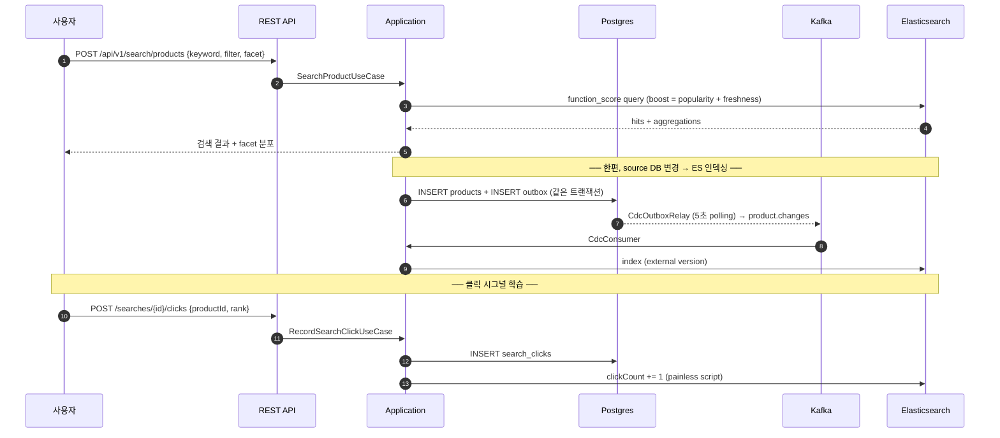
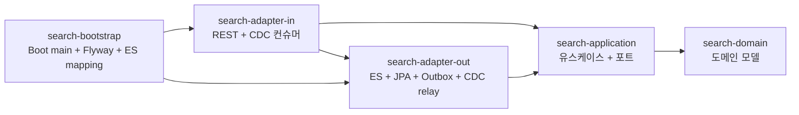

# Search Service

commerce 상품 검색 서비스의 백엔드입니다. 키워드 검색, 자동완성, faceted filter, 사용자
검색 클릭 로그 기반 boost (function_score), CDC 인덱싱 파이프라인, 운영 중 무중단 reindex
(alias swap) 를 제공합니다.

## 기술 스택

- **Language**: Java 21 (virtual threads)
- **Framework**: Spring Boot 3.4.1
- **Source DB**: PostgreSQL 16, Flyway
- **Search Engine**: Elasticsearch 8.15 (공식 Java Client)
- **Messaging**: Apache Kafka (CDC topic — `product.changes`)
- **Resilience**: Resilience4j (Circuit Breaker, Retry — ES 호출 보호)
- **Build / CI**: Gradle 8, GitHub Actions, Docker, Kubernetes

## 주요 요구사항

- **검색 결과의 즉각 반영**: source DB 의 상품 추가 / 변경 / 삭제가 ES 에 누락 없이 반영되어야
  합니다. ES 장애가 source 도메인 흐름을 멈추지 않아야 합니다.
- **운영 중 mapping 변경**: analyzer / 매핑을 바꿔야 할 때 검색 무중단으로 새 인덱스 전환이
  가능해야 합니다.
- **인기도 학습**: 검색 결과에서 사용자가 클릭한 상품이 다음 검색의 상위에 노출되어야
  합니다.
- **0건 검색 회복**: 사용자 오타 / 오인 키워드로 결과 0건이 나오면 가까운 인기 키워드를
  제안해야 합니다.
- **운영 부하 보호**: facet aggregation 의 cardinality 가 비정상적으로 커지지 않도록 도메인
  단계에서 상한을 둔다.

## 핵심 설계 결정

### 1. CDC 기반 indexing pipeline (Outbox + Kafka)

도메인 트랜잭션이 source DB 변경과 같은 트랜잭션으로 outbox 행을 INSERT 합니다. 별도
relay 가 5초마다 unpublished 행을 polling 해 Kafka 토픽 `product.changes` 로 발행하고,
컨슈머가 ES 에 indexing 합니다. ES 장애가 source 도메인을 멈추지 않으며, ES 의 external
version 비교로 같은 메시지가 두 번 처리되어도 결과 정합. (ADR-0004)

### 2. alias 기반 zero-downtime reindex

검색은 항상 alias (`products`) 로 호출됩니다. 운영에서 mapping 변경이 필요하면 새 물리
인덱스 (`products-v202608`) 를 만들고 source DB 에서 bulk indexing 한 뒤, doc count 가
일치할 때만 alias 를 atomic swap 합니다. (ADR-0005)

### 3. function_score 기반 boost rule

ES `function_score` 로 두 시그널을 BM25 점수에 곱합니다.
- **인기도** — `log1p(clickCount) * popularityWeight` (log 함수라 클릭 수 폭증해도 안정).
- **신상품** — 출시일 origin 의 `gauss decay` (반감기 30일 default).

검색 결과 클릭 → ES 의 해당 product `clickCount += 1` (painless partial update) →
다음 검색에 즉시 반영. (ADR-0006)

### 4. multi-field mapping (text + keyword + autocomplete)

`name` 필드 하나가 세 형태로 indexing 됩니다.
- `name` (text + standard analyzer) — 일반 키워드 매칭.
- `name.keyword` (keyword) — 정렬 / aggregation.
- `name.autocomplete` (text + edge_ngram 1-10) — 자동완성. (ADR-0003, ADR-0007)

### 5. facet aggregation 의 메모리 보호

`FacetSpec` 도메인 객체가 cardinality 상한 (terms size ≤ 100) 과 사용 가능 필드를 강제.
사용자가 `size: 1M` 같은 위험한 값을 보내도 도메인 단계에서 차단. (ADR-0008)

### 6. Resilience4j 로 ES 호출 격리

ES 호출에 Circuit Breaker + Retry 적용. ES 응답 실패율이 임계치를 넘으면 즉시 회로 차단
— ES 의 긴 응답 지연이 우리 처리 흐름에 영향을 주지 않도록 합니다.

설계 결정의 상세 배경은 [docs/adr/](docs/adr/) 의 ADR 8건에 정리되어 있습니다.

## 시스템 흐름



## 모듈 구조



| 모듈 | 책임 |
|---|---|
| `search-domain` | 순수 도메인 (Spring 의존 0) — `Product`, `SearchQuery`, `IndexDocument`, `FacetSpec`, `BoostRule`, `ProductChangeEvent` |
| `search-application` | 7개 유스케이스 + outbound port (검색엔진 / 인덱스 writer / source repo / 클릭 repo) |
| `search-adapter-in` | REST 컨트롤러 + CDC Kafka 컨슈머 |
| `search-adapter-out` | Elasticsearch Java Client + JPA + Outbox + CdcOutboxRelay |
| `search-bootstrap` | Spring Boot 진입점, Flyway, ES mapping JSON, 모든 빈 등록 |
| `e2e-tests` | 메모리 모드 e2e + Testcontainers ES IT (`@Tag("integration")`) |

## 7개 use case

| # | UseCase | 진입점 |
|---|---------|--------|
| 1 | `SearchProductUseCase` | `POST /api/v1/search/products` — 키워드 + filter + facet + boost |
| 2 | `AutocompleteUseCase` | `GET /api/v1/search/autocomplete?q=` — edge_ngram prefix |
| 3 | `IndexProductUseCase` | CDC 컨슈머 (INSERT/UPDATE 위임) |
| 4 | `ReindexAllUseCase` | `POST /api/v1/admin/index/reindex` — alias swap |
| 5 | `RecordSearchClickUseCase` | `POST /api/v1/search/searches/{id}/clicks` |
| 6 | `SuggestRelatedUseCase` | `GET /api/v1/search/related?q=` — fuzzy (Levenshtein) |
| 7 | `HandleProductChangeUseCase` | CDC 컨슈머 진입점 (INSERT/UPDATE/DELETE 분기) |

## 실행 방법

ES / Kafka 없이 메모리 모드로 부팅하면 외부 의존 없이 전체 use case 가 동작합니다.

```bash
# 메모리 모드 — ES / Kafka 없이 부팅
SEARCH_ENGINE=memory ./gradlew :search-bootstrap:bootRun

# 데모 시나리오 — 검색 / 자동완성 / 관련 / 클릭 / reindex 한 cycle
./scripts/demo.sh
```

운영 모드 (실제 ES + Kafka):

```bash
# 인프라 띄우기
docker compose -f infrastructure/docker-compose.yml up -d

# 앱 부팅 (실제 ES 사용)
SEARCH_ENGINE=elasticsearch \
SEARCH_KAFKA_ENABLED=true \
ELASTICSEARCH_HOST=localhost:9200 \
KAFKA_BOOTSTRAP=localhost:9092 \
./gradlew :search-bootstrap:bootRun
```

- API 문서: <http://localhost:8080/swagger-ui.html>
- Kibana (운영 모드): <http://localhost:5601>
- Kafka UI (운영 모드): <http://localhost:8081>

## API 예시

### 검색 (filter + facet)

```bash
curl -X POST http://localhost:8080/api/v1/search/products \
  -H 'Content-Type: application/json' \
  -d '{
    "keyword": "Air Max",
    "filters": [
      {"field":"brand","op":"terms","values":["Nike","Adidas"]},
      {"field":"priceWon","op":"range","from":100000,"to":300000}
    ],
    "facets": [
      {"name":"by-brand","field":"brand","type":"terms","size":10},
      {"name":"price-range","field":"priceWon","type":"range",
       "buckets":[
         {"key":"100k-200k","from":100000,"to":200000},
         {"key":"200k+","from":200000}
       ]}
    ],
    "page": 0,
    "size": 20
  }'
```

### 자동완성

```bash
curl 'http://localhost:8080/api/v1/search/autocomplete?q=Air&limit=10'
```

### 클릭 기록 (boost 학습 시그널)

```bash
curl -X POST http://localhost:8080/api/v1/search/searches/s-1/clicks \
  -H 'Content-Type: application/json' \
  -d '{"productId":"p-1","userId":"u-1","keyword":"Air","rank":1}'
```

### 운영 reindex (alias swap)

```bash
curl -X POST http://localhost:8080/api/v1/admin/index/reindex \
  -H 'Content-Type: application/json' \
  -d '{"suffix":"v202605","dropOld":false}'
```

## 테스트 및 빌드

```bash
./gradlew check                       # 단위 테스트 (default — integration 제외)
./gradlew integrationTest             # Testcontainers ES + Postgres + Kafka
./gradlew :search-domain:test         # 도메인 단위
./gradlew :search-bootstrap:bootJar   # 배포용 jar 생성
```

| 모듈 | 단위 테스트 | 검증 |
|---|---|---|
| domain | 23 | Money, Product, SearchQuery, IndexDocument, FacetSpec invariant |
| application | 12 | 7개 use case (mockito) |
| adapter-out | 14 | InMemorySearchEngineAdapter, Levenshtein, ProductDtoMapper |
| adapter-in | 9 | SearchRequestMapper, SearchController slice (MockMvc) |
| bootstrap | 1 | Spring 컨텍스트 부팅 (memory 모드) |
| e2e-tests | 2 + 1 IT | 메모리 e2e full flow + Testcontainers ES (@Tag integration) |

## 운영 모드 (`prod` profile)

- PostgreSQL, Elasticsearch, Kafka 실제 사용 (`SEARCH_ENGINE=elasticsearch`,
  `SEARCH_KAFKA_ENABLED=true`)
- ES 호출에 Resilience4j Circuit Breaker + Retry 적용
- CDC outbox relay 5초 주기로 active
- Actuator + Prometheus metric 노출 (`/actuator/prometheus`)

## 인프라

- `infrastructure/Dockerfile`: multi-stage 빌드 (JDK 21 → JRE 21), non-root, ZGC
- `infrastructure/docker-compose.yml`: 로컬 통합 환경 (postgres, ES, Kibana, Kafka, Kafka UI)
- `infrastructure/k8s/`: PSS restricted, HPA (CPU 60% → 3..12), PDB (minAvailable 2),
  resource limits, readonly root filesystem
- `.github/workflows/ci.yml`: workflow_dispatch — gradle check + integrationTest +
  Docker build (push 없음)

## 향후 개선 사항

- nori (한국어 형태소) analyzer 적용 — 한국어 키워드 검색의 정확도 향상
- 초성 / 자음 검색 — Hangul Jamo filter 를 edge_ngram 위에 추가
- Debezium 정식 도입 — outbox polling → WAL 기반 sub-second indexing
- Learning-to-Rank (LTR) — 클릭 / 구매 / dwell time 기반 학습 모델
- 운영자 대시보드 — slow query / facet 사용 분포 / boost rule A/B
