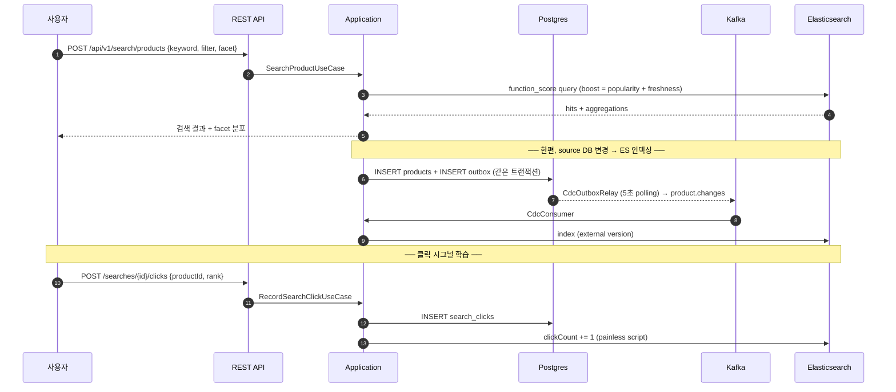
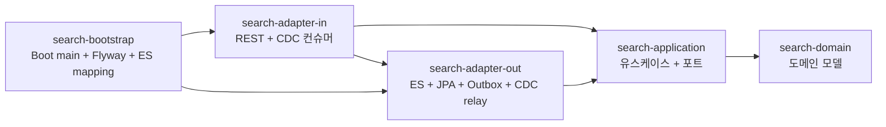
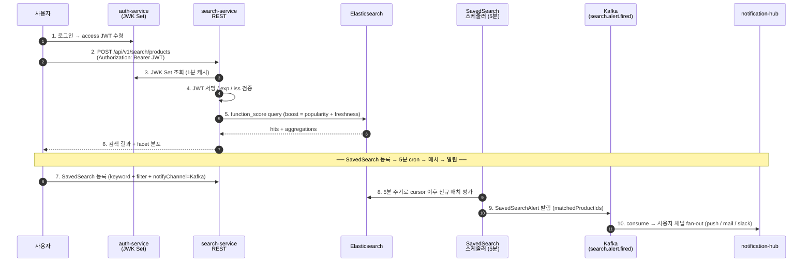

# Search Service

commerce 상품 검색 서비스의 백엔드입니다. 키워드 검색, 자동완성, faceted filter, 사용자
검색 클릭 로그 기반 boost (function_score), CDC 인덱싱 파이프라인, 운영 중 무중단 reindex
(alias swap) 를 제공합니다.

## 기술 스택

- **Language**: Java 21 (virtual threads)
- **Framework**: Spring Boot 3.4.1
- **Source DB**: PostgreSQL 16, Flyway
- **Search Engine**: Elasticsearch 8.15 (공식 Java Client)
- **Messaging**: Apache Kafka (CDC topic — `product.changes`)
- **Resilience**: Resilience4j (Circuit Breaker, Retry — ES 호출 보호)
- **Build / CI**: Gradle 8, GitHub Actions, Docker, Kubernetes

## 주요 요구사항

- **검색 결과의 즉각 반영**: source DB 의 상품 추가 / 변경 / 삭제가 ES 에 누락 없이 반영되어야
  합니다. ES 장애가 source 도메인 흐름을 멈추지 않아야 합니다.
- **운영 중 mapping 변경**: analyzer / 매핑을 바꿔야 할 때 검색 무중단으로 새 인덱스 전환이
  가능해야 합니다.
- **인기도 학습**: 검색 결과에서 사용자가 클릭한 상품이 다음 검색의 상위에 노출되어야
  합니다.
- **0건 검색 회복**: 사용자 오타 / 오인 키워드로 결과 0건이 나오면 가까운 인기 키워드를
  제안해야 합니다.
- **운영 부하 보호**: facet aggregation 의 cardinality 가 비정상적으로 커지지 않도록 도메인
  단계에서 상한을 둔다.

## 핵심 설계 결정

### 1. CDC 기반 indexing pipeline (Outbox + Kafka)

도메인 트랜잭션이 source DB 변경과 같은 트랜잭션으로 outbox 행을 INSERT 합니다. 별도
relay 가 5초마다 unpublished 행을 polling 해 Kafka 토픽 `product.changes` 로 발행하고,
컨슈머가 ES 에 indexing 합니다. ES 장애가 source 도메인을 멈추지 않으며, ES 의 external
version 비교로 같은 메시지가 두 번 처리되어도 결과 정합. (ADR-0004)

### 2. alias 기반 zero-downtime reindex

검색은 항상 alias (`products`) 로 호출됩니다. 운영에서 mapping 변경이 필요하면 새 물리
인덱스 (`products-v202608`) 를 만들고 source DB 에서 bulk indexing 한 뒤, doc count 가
일치할 때만 alias 를 atomic swap 합니다. (ADR-0005)

### 3. function_score 기반 boost rule

ES `function_score` 로 두 시그널을 BM25 점수에 곱합니다.
- **인기도** — `log1p(clickCount) * popularityWeight` (log 함수라 클릭 수 폭증해도 안정).
- **신상품** — 출시일 origin 의 `gauss decay` (반감기 30일 default).

검색 결과 클릭 → ES 의 해당 product `clickCount += 1` (painless partial update) →
다음 검색에 즉시 반영. (ADR-0006)

### 4. multi-field mapping (text + keyword + autocomplete)

`name` 필드 하나가 세 형태로 indexing 됩니다.
- `name` (text + standard analyzer) — 일반 키워드 매칭.
- `name.keyword` (keyword) — 정렬 / aggregation.
- `name.autocomplete` (text + edge_ngram 1-10) — 자동완성. (ADR-0003, ADR-0007)

### 5. facet aggregation 의 메모리 보호

`FacetSpec` 도메인 객체가 cardinality 상한 (terms size ≤ 100) 과 사용 가능 필드를 강제.
사용자가 `size: 1M` 같은 위험한 값을 보내도 도메인 단계에서 차단. (ADR-0008)

### 6. Resilience4j 로 ES 호출 격리

ES 호출에 Circuit Breaker + Retry 적용. ES 응답 실패율이 임계치를 넘으면 즉시 회로 차단
— ES 의 긴 응답 지연이 우리 처리 흐름에 영향을 주지 않도록 합니다. (ADR-0012)

### 7. CDC consumer DLQ + manual replay

CDC 컨슈머가 처리 실패한 메시지는 retry 후 DLT (`product.changes.DLT`) 로 격리, source
컨슈머는 다음 메시지로 진행. 운영자는 `/api/v1/admin/cdc/dlt/replay` 로 원인 해결 후
재처리. (ADR-0013)

### 8. Outbox 정리 + 멀티 인스턴스 안전 스케줄

Outbox 의 published 행은 retention 정책에 따라 정리 — `@Scheduled` 작업이 ShedLock 으로
한 인스턴스만 실행되도록 제어. (ADR-0014)

### 9. nori 한국어 형태소 + 도메인 user_dictionary

`name` 의 분석기를 nori 로 교체. user_dictionary 로 "조던1", "덩크로우" 같은 도메인 고유
명사를 단일 토큰으로 보존, `nori_part_of_speech` 로 조사 / 어미 제거. (ADR-0015)

### 10. 운영자 동의어 사전 + 런타임 reload

운영자가 등록한 동의어 그룹을 ES `synonym_graph` filter 로 빌드, alias swap 으로 무중단
적용. zero-result 키워드를 보고 운영자가 *즉시* 동의 관계를 추가 가능. (ADR-0017)

### 11. 저장 검색 (Saved Search) + 신규 매치 알림

사용자가 검색 조건을 저장 → 5분 주기 스케줄러가 cursor 이후 신규 매치 평가 → Kafka topic
`search.alert.fired` 로 알림 발행. notification-hub 등 외부 service 가 채널별 발송. ShedLock
으로 멀티 인스턴스 중복 방지. (ADR-0016)

### 12. 검색 query analytics — Top / Zero-result / Latency / CTR

검색 호출마다 `search_events` 에 기록. 운영 admin 이 4종 분석 (인기 검색어, 0건 검색어,
응답 latency p50/p95/p99, click-through rate) 을 시간 구간으로 조회. zero-result 분석이
동의어 / boost rule 운영의 입력. (ADR-0018)

설계 결정의 상세 배경은 [docs/adr/](docs/adr/) 의 ADR 18건에 정리되어 있습니다.

## 시스템 흐름



## 모듈 구조



| 모듈 | 책임 |
|---|---|
| `search-domain` | 순수 도메인 (Spring 의존 0) — `Product`, `SearchQuery`, `IndexDocument`, `FacetSpec`, `BoostRule`, `ProductChangeEvent`, `SavedSearch`, `SynonymGroup`, `SearchEvent` |
| `search-application` | 검색 / 인덱싱 / 동의어 / 저장검색 / 분석 use case + outbound port |
| `search-adapter-in` | REST 컨트롤러 (search + admin) + CDC Kafka 컨슈머 + DLT consumer |
| `search-adapter-out` | Elasticsearch Java Client + JPA + Outbox + CdcOutboxRelay + SavedSearch evaluator + 동의어 sync + analytics writer |
| `search-bootstrap` | Spring Boot 진입점, Flyway, ES mapping JSON, ShedLock, 모든 빈 등록 |
| `e2e-tests` | 메모리 모드 e2e + Testcontainers ES IT (Nori, Resilience4j, 검색 flow — `@Tag("integration")`) |

## Use case 와 진입점

검색 7종 + 동의어 4종 + 저장검색 4종 + 분석 1종 (단일 facade UseCase 가 4종 admin 조회)
구조. REST + CDC consumer + 스케줄러 가 진입점.

| 영역 | 진입점 | 비고 |
|---|---|---|
| 키워드 검색 | `POST /api/v1/search/products` | filter + facet + function_score boost |
| 자동완성 | `GET /api/v1/search/autocomplete?q=` | edge_ngram prefix |
| 관련 검색어 | `GET /api/v1/search/related?q=` | fuzzy (Levenshtein) — zero-result 회복 |
| 클릭 시그널 | `POST /api/v1/search/searches/{id}/clicks` | boost 학습 입력 |
| Reindex | `POST /api/v1/admin/index/reindex` | alias swap, 무중단 |
| CDC 컨슈머 | Kafka topic `product.changes` | INSERT/UPDATE/DELETE 분기 → ES |
| CDC DLT 재처리 | `POST /api/v1/admin/cdc/dlt/replay` | 운영 수동 replay |
| 동의어 등록 / 조회 / 삭제 | `POST/GET/DELETE /api/v1/admin/synonyms` | `X-Operator-Id` 헤더로 audit |
| 동의어 ES 적용 | `POST /api/v1/admin/synonyms/apply` | settings update + alias swap |
| 저장 검색 평가 | `@Scheduled` (5분 주기, ShedLock) | cursor 이후 신규 매치만 → Kafka 알림 |
| 검색 분석 — top / zero-result / latency / CTR | `GET /api/v1/admin/analytics/{queries/top \| queries/zero-result \| latency \| ctr}` | `from`, `to` ISO-8601 instant |

## 실행 방법

ES / Kafka 없이 메모리 모드로 부팅하면 외부 의존 없이 전체 use case 가 동작합니다.

```bash
# 메모리 모드 — ES / Kafka 없이 부팅
SEARCH_ENGINE=memory ./gradlew :search-bootstrap:bootRun

# 데모 시나리오 — 검색 / 자동완성 / 관련 / 클릭 / reindex 한 cycle
./scripts/demo.sh
```

운영 모드 (실제 ES + Kafka):

```bash
# 인프라 띄우기
docker compose -f infrastructure/docker-compose.yml up -d

# 앱 부팅 (실제 ES 사용)
SEARCH_ENGINE=elasticsearch \
SEARCH_KAFKA_ENABLED=true \
ELASTICSEARCH_HOST=localhost:9200 \
KAFKA_BOOTSTRAP=localhost:9092 \
./gradlew :search-bootstrap:bootRun
```

- API 문서: <http://localhost:8080/swagger-ui.html>
- Kibana (운영 모드): <http://localhost:5601>
- Kafka UI (운영 모드): <http://localhost:8081>

## API 예시

### 검색 (filter + facet)

```bash
curl -X POST http://localhost:8080/api/v1/search/products \
  -H 'Content-Type: application/json' \
  -d '{
    "keyword": "Air Max",
    "filters": [
      {"field":"brand","op":"terms","values":["Nike","Adidas"]},
      {"field":"priceWon","op":"range","from":100000,"to":300000}
    ],
    "facets": [
      {"name":"by-brand","field":"brand","type":"terms","size":10},
      {"name":"price-range","field":"priceWon","type":"range",
       "buckets":[
         {"key":"100k-200k","from":100000,"to":200000},
         {"key":"200k+","from":200000}
       ]}
    ],
    "page": 0,
    "size": 20
  }'
```

### 자동완성

```bash
curl 'http://localhost:8080/api/v1/search/autocomplete?q=Air&limit=10'
```

### 클릭 기록 (boost 학습 시그널)

```bash
curl -X POST http://localhost:8080/api/v1/search/searches/s-1/clicks \
  -H 'Content-Type: application/json' \
  -d '{"productId":"p-1","userId":"u-1","keyword":"Air","rank":1}'
```

### 운영 reindex (alias swap)

```bash
curl -X POST http://localhost:8080/api/v1/admin/index/reindex \
  -H 'Content-Type: application/json' \
  -d '{"suffix":"v202605","dropOld":false}'
```

## 테스트 및 빌드

```bash
./gradlew check                       # 단위 테스트 (default — integration 제외)
./gradlew integrationTest             # Testcontainers ES + Postgres + Kafka
./gradlew :search-domain:test         # 도메인 단위
./gradlew :search-bootstrap:bootJar   # 배포용 jar 생성
```

| 모듈 | 단위 테스트 | 검증 |
|---|---|---|
| domain | 53 | Money, Product, SearchQuery, IndexDocument, FacetSpec, SynonymGroup, SavedSearch, SearchEvent, NotifyChannel, ClickThroughRate invariant |
| application | 35 | use case 들 (mockito) — 검색 / 인덱싱 / 동의어 / 저장검색 / 분석 |
| adapter-out | 27 | InMemorySearchEngineAdapter, Levenshtein, ProductDtoMapper, OutboxRetentionJob, ResilientSearchClient, analytics writer / reader |
| adapter-in | 9 | SearchRequestMapper, SearchController slice (MockMvc) |
| bootstrap | 12 | Spring 컨텍스트 부팅, HikariPool config, ApplicationReadinessCoordinator, CdcErrorHandler, analytics integration |
| e2e-tests | 2 + Testcontainers IT | 메모리 e2e full flow + nori analyzer IT + Elasticsearch search IT (`@Tag("integration")`) |

## 운영 모드 (`prod` profile)

- PostgreSQL, Elasticsearch, Kafka 실제 사용 (`SEARCH_ENGINE=elasticsearch`,
  `SEARCH_KAFKA_ENABLED=true`)
- ES 호출에 Resilience4j Circuit Breaker + Retry 적용
- CDC outbox relay 5초 주기로 active
- Actuator + Prometheus metric 노출 (`/actuator/prometheus`)

## 인프라

- `infrastructure/Dockerfile`: multi-stage 빌드 (JDK 21 → JRE 21), non-root, ZGC
- `infrastructure/docker-compose.yml`: 로컬 통합 환경 (postgres, ES, Kibana, Kafka, Kafka UI)
- `infrastructure/docker-compose.integration.yml`: portfolio set 통합 시연 — 본 service +
  auth-stub + notification-hub-stub
- `infrastructure/k8s/`: PSS restricted, HPA (CPU 60% → 3..12), PDB (minAvailable 2),
  resource limits, readonly root filesystem (raw manifest 형태)
- `helm/search-service/`: 같은 구성을 helm chart 로 packaging — values 기반 환경별 분기
- `.github/workflows/ci.yml`: workflow_dispatch — gradle check + integrationTest +
  Docker build (push 없음)

### Helm chart

`infrastructure/k8s/` 의 raw manifest 와 동일한 형상을 chart 로 packaging 했습니다.
환경별 분기 (dev / prod) 와 외부 secret (ExternalSecrets / sealed-secrets / vault) 참조를
values 한 곳에서 관리합니다.

```
helm/search-service/
  Chart.yaml
  values.yaml          # 개발 / 스테이징 baseline (replica 1, ingress / HPA / NP off)
  values-prod.yaml     # 운영 override (replica 3, HPA, ingress TLS, NetworkPolicy)
  templates/
    _helpers.tpl
    serviceaccount.yaml
    configmap.yaml
    secret.yaml         # placeholder — 운영은 외부 secret 사용 (existingSecret)
    service.yaml
    deployment.yaml     # 3종 probe + preStop + graceful shutdown + ZGC
    ingress.yaml        # /api/v1/search/* + /api/v1/admin/* 두 path
    hpa.yaml
    pdb.yaml
    networkpolicy.yaml  # ingress-nginx 만 진입 허용 + 외부 의존 (PG/OS/Kafka/DNS) 화이트리스트
```

```bash
# lint
helm lint helm/search-service
helm lint helm/search-service -f helm/search-service/values-prod.yaml

# 렌더링 미리보기 (dev / prod)
helm template search helm/search-service
helm template search helm/search-service -f helm/search-service/values-prod.yaml

# 운영 install — opensearch credentials 는 별도 secret (search-service-opensearch) 가
# 미리 만들어져 있어야 한다 (ExternalSecrets 가 만들거나 sealed-secrets 로 commit).
helm install search-service ./helm/search-service \
  -n search-service --create-namespace \
  -f helm/search-service/values.yaml \
  -f helm/search-service/values-prod.yaml
```

운영 chart 의 *secret 정책*: `secret.create=false` 가 default. helm 으로 평문 secret 을
commit 하지 않기 위해 `opensearch.auth.existingSecret` 와 `secret.name` (Postgres) 으로
외부 secret 을 참조합니다. 로컬 / dev 검증 한정으로 `--set secret.create=true` 가
허용됩니다.

## Portfolio Set 통합

이 저장소는 8개 백엔드 저장소가 한 시스템처럼 동작하도록 묶인 포트폴리오 셋의 한
구성 요소입니다. profile 인덱스: <https://github.com/ssa1004/ssa1004>

| 저장소 | 역할 | search-service 와의 관계 |
|---|---|---|
| `auth-service` | OAuth2 / OIDC IdP — JWT 발행 + JWK 노출 | 사용자 / 서비스 호출 시 검증할 JWT 의 issuer (JWK Set 소비) |
| `resell-orderbook` | 한정판 리셀 거래소 | 거래 완료된 product 변경을 CDC `product.changes` 로 발사 → 본 service 가 색인 |
| `billing-platform` | B2B SaaS 결제 / 청구 / 정산 | 결제 결과로 status 가 바뀐 product 변경을 CDC 로 발사 → 색인 |
| `gpu-job-orchestrator` | GPU job 관리 백엔드 | 인접 도메인 — 당장 직접 통합점은 없으나 같은 운영 환경 공유 |
| `notification-hub` | 다채널 알림 발송 hub (mail / push / slack) | SavedSearch 매치 시 본 service 가 발사하는 `search.alert.fired` 의 consumer |
| `security-log-search` | SIEM (보안 로그 정규화 + 검색 + 알람) | 본 service 의 admin endpoint audit log 의 sink |
| `mini-shop-observability` | 자체 Spring observability 모듈 + MSA 플레이그라운드 | tracing / metric 라이브러리 컨벤션 공유 |
| `search-service` | (본 저장소) commerce 상품 검색 백엔드 | 위 도메인 변경의 색인 + SavedSearch 매치 알림 |

### 통합 흐름



> 본 저장소의 REST 컨트롤러는 현 단계에서 JWT 를 직접 검증하지 않습니다 (별도 ADR
> 으로 정리 예정). 위 다이어그램의 (3) (4) 단계는 portfolio set 에서 JWT 통합 시 본
> service 가 진입할 위치를 표시한 것이며, 실제 검증은 `notification-hub` / `auth-service`
> 등 이미 OAuth2 resource-server 가 적용된 인접 service 에서 가동 중입니다.

### 시연 — `docker-compose.integration.yml`

전 8 레포를 같이 띄우지 않고도, stub 으로 cross-repo 흐름만 닫아 한 호스트에서 시연
가능한 compose 파일을 제공합니다.

- `infrastructure/docker-compose.integration.yml`
  - `search-service` 본체 + Postgres + Elasticsearch (nori) + Kafka
  - `auth-stub` — `auth-service` 의 JWK Set 만 정적으로 노출 (nginx — `/.well-known/jwks.json`,
    `/oauth2/jwks`)
  - `notification-hub-stub` — `search.alert.fired` topic 을 stdout 으로 echo 하는 컨슈머
    컨테이너. 실제 hub 는 본 메시지를 받아 push / mail / slack 으로 fan-out
  - `domain-producer` — 시연 스크립트가 `docker exec` 로 CDC 이벤트 / SavedSearchAlert 를
    발사할 때 사용하는 idle 컨테이너 (kafka client + curl 만 있으면 충분)

- `scripts/integration-demo.sh` — 위 compose 를 띄우고 다음 한 사이클을 stdout 으로 확인:
  1. mock JWT 발급 (auth-stub 의 JWK 와 짝지은 평문 RS256 토큰)
  2. sample product 색인 → 검색 → 결과 확인
  3. SavedSearchAlert 메시지 발행 → notification-hub-stub 가 받는 것까지

```bash
docker compose -f infrastructure/docker-compose.integration.yml up -d --build
./scripts/integration-demo.sh
```

cross-repo 통합은 어디까지나 *스펙 시연* 용입니다. 실제 운영에서는 각 저장소를 별도
배포하고 Kubernetes Service / Kafka cluster 를 매개로 연결합니다.

## 향후 개선 사항

- 초성 / 자음 검색 — Hangul Jamo filter 를 edge_ngram 위에 추가
- Debezium 정식 도입 — outbox polling → WAL 기반 sub-second indexing
- Learning-to-Rank (LTR) — 클릭 / 구매 / dwell time 기반 학습 모델
- 운영자 대시보드 UI — 현재의 admin REST API (analytics / synonyms / DLT replay) 위에 화면
- SavedSearch 알림 빈도 조절 — 한 사용자 단위 시간 N회 이상이면 통합
- REST 진입점 JWT 검증 활성화 — 위 통합 흐름의 (3) (4) 단계를 정식 코드로 강제
